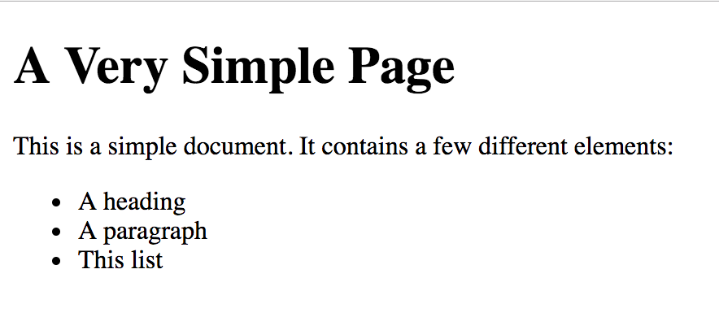
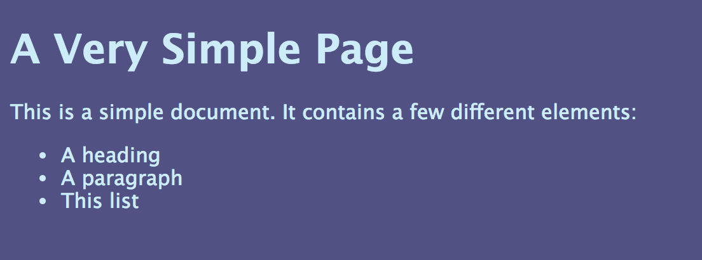
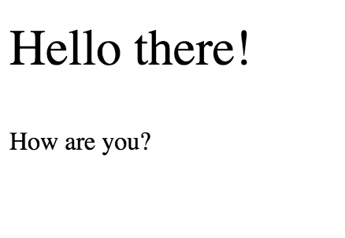

theme: Fira, 2


---

# [fit] HTML

## [fit] `Hyper Text Markup Language`

^ HTML is "DATA", not "CODE", a way of describing content, it's not a "program"

---

```
A Very Simple Page
This is a simple document. It contains a few different elements:
A heading
A paragraph
This list
```

^ HTML forms the structure of a web page. If you were to view a document that contained only plain text, it would be difficult to distinguish between titles, headings, paragraphs, lists, etc.

---

```html
<h1>A Very Simple Page</h1>
<p>This is a simple document. It contains a few different elements:</p>
<ul>
  <li>A heading</li>
  <li>A paragraph</li>
  <li>This list</li>
</ul>
```

^ With HTML, the same content is formatted in a way that's readable and meaningful to both humans _and_ browsers.

---



---


^ In HTML, content is written using **tags**. Tags can be be "wrapped" around content, as with a `<p>` tag, where an opening `<p>` is at the beginning of the paragraph and a closing `</p>` tag is at the end. Other tags are self-closing, such as the `` tag.

^ Sometimes you'll see "self-closing" tags referred to as "void" tags. These are the same thing.

---


^ A typical HTML document needs a few basic things to work:

---

# `<!DOCTYPE html>`

^ The doctype tag exists for legacy reasons. Omitting causes some browsers to render pages drastically different, but including this minimal tag triggered standards most in all browsers at the time HTML5 was published, so we keep it simple going forward.

---

## `<!DOCTYPE html PUBLIC "-//W3C//DTD XHTML Basic 1.1//EN" "http://www.w3.org/TR/xhtml-basic/xhtml-basic11.dtd">`

---

# `<html></html>`

* The root (top-level) element of an HTML document
* All other elements are descendants of this element

---

# `<head></head>`

* Information for the browser about the document (metadata)
* E.g. title and links to scripts and style sheets

---

# `<body></body>`

* the content of your document.
* There can be only one.

---


---

^ Many code editors provide **snippets** to quickly insert this into a new HTML file.

```html
<!DOCTYPE html>
<html>
  <head>
    <title></title>
    <!-- Other "meta data" -->
  </head>
  <body>
    <!-- Visible content -->
  </body>
</html>
```

---

# [fit] `<!-- an HTML comment -->`

---

^ Without a doubt, you'll see some HTML elements much more often than others. Some you may never even see in the wild without a long search. Here are a few of the most common elements:

# `<p></p>`

Short for "paragraph". It's the basic container for plain text.

---

# `<div></div>`

Short for "divider" and is the most generic way to wrap up a block of content.

^ It's older than most of the content sectioning elements, so `div` tags were previously be used for headers, navigation, sections, etc. Since HTML5 introduced much more semantic tags, we now use `div`s only when no other element makes sense.

---

# `<a></a>`

Used for links, and is short for "anchor"

---

# `<h1></h1> ... <h6></h6>`

Short for "Heading". Introduces the content that follows.

---

# ``

Short for "image".

^ Note that this is a self-closing, or "void" tag.

---

^ Many of the tags you'll write in HTML will have attributes, and some tags will actually do almost nothing without attributes.


---

```html
<a href="cool.com">Cool</a>
```

---

^ One of the most important HTML attributes is `class`:

```html
<p class="introduction">This is the introduction.</p>
```

^ This `introduction` class doesn't do much on its own, but when paired with CSS, as we'll see later, it becomes a powerful tool for styling elements on the page.

---

# [fit] se·man·tic
*/səˈman(t)ik/*
_adjective_
> relating to meaning in language or logic.

^ definition of “semantics”: the linguistic and philosophical study of meaning -- in language, programming languages, logic i.e. the relationship between words, phrases, signs, and symbols, etc.

---

## What is "Semantic" HTML?

* Informs browser Rendering
* Assistive Technology (accessibility)
* SEO

^ HTML that uses correct and meaningful tags is generally called **semantic markup**. When a document is "marked up" with the correct HTML tags, browsers can properly render information, correctly display links and buttons, and search engines can better understand the hierarchy and importance of the content.

^ This also helps improve the browsing experience for users using assistive technology. A user with a visual impairment may rely on a **screen reader** application to create audio descriptions of a page; when proper HTML is written, screen readers can correctly explain a page's content correctly to the listener.

---

## `<header></header>`

^ contains the kind of content you often see at the top of a page - a site logo, navigation links, a search form, etc. A page header can also contain a "title" for the page, but in a heading element such as an h1. The `title` element is part of the `head` element; the `header` and headings `h1` through `h6` belong in the `body`.

---

## `<footer></footer>`

^ typically contains copyright and/or author information about the section, article, or page that encloses it.

---

# [fit] CSS

## `Cascading Style Sheets`

^ As you've seen from the examples we've looked at, plain HTML has very little styling. It does have _some_ default styles to help users visually distinguish between headings and other elements, but otherwise its quite plain.

^ **CSS** allows us to specify general styles to a subset of elements. CSS code generally lives in separate files known as **stylesheets**. This pattern is powerful, in that we can store all of a site's styles in one file, even if the site consists of many pages.

---


^ CSS can be used to style the same content in a variety of ways.

---

^ Here's the simple page from earlier:


---

^ Now we add a little CSS styling:



---

```css
body {
  background: #515184;
  color: #cdecf9;
  font-family: "Lucida Grande", sans-serif;
  font-size: 16px;
}
```

---


---

```css
p {
  color: #fa0bc0;
  text-align: right;
}
```

---

# CSS Rules has two parts

* a **selector**, that specifies which elements should be styled this way
* a list of **declarations**, that each consist of a `property` and a `value`

---

## Using CSS selectors

^ Earlier we saw a `<p>` being styled. Using a tag name as a selector like this effectively states "find all `<p>` tags on the page and set these properties". While this is useful, often times you'll only want to style a subset of a certain element.

^ For example, to style only some `<p>` tags with larger text, you can add a **class** attribute to the paragraphs you'd like to style in the HTML, and use that class as a selector in the CSS. Without the boilerplate HTML, it might look something like this:

`index.html`

```html
<p class="larger-text">Hello there!</p>
<p>How are you?</p>
```

`screen.css`

```css
.larger-text {
  font-size: 32px;
}
```

^ Notice the dot (`.`) before `larger-text` in the CSS? This small distinction is important, because **CSS uses a preceding dot to distinguish between tag names and class names**.

---



---

## Common CSS Properties

* `color` is used to set text color. Values are usually written in hex format
* `background-color` is used to set background color. Values are usually written in hex format
* `font-size` sets the size of the text inside of the selected elements. Values are numeric, and require a unit of measurement, such as `20px` (pixels) or `3em` (ems).
* `text-decoration` is typically used to make text look underlined. `<a>` text have a `text-decoration` value of `underline` by default
* `height` is used to explicitly set the height of a block-level element (but won't work on inline elements). Values are numeric but require a unit of measurement, usually as pixels (`px`) or percentage (`%`)
* `width` follows the same rules as height, but for width of elements from left to right

---

## Embedding a Stylesheet

```html
<html>
  <head>
    <style>
      h1 {
        color:red;
      }
      p {
        color:blue;
      }
    </style>
  </head>
  <body>
    <h1>A heading</h1>
    <p>A paragraph.</p>
  </body>
</html>
```

---

## Linking to an External Stylesheet

^ To start using the styles from an external stylesheet, a special HTML tag is required. When using a self-closing `<link>` tag inside of the `<head></head>` tags, the browser will load all of the styles and apply them automatically to the HTML that matches your selectors (more on selectors below).

```html
<head>
  <link rel="stylesheet" type="text/css" href="styles.css">
</head>
```

---
